# Lobster Detection Mobile Application - CSCIX691 Summer 2021 - Dalhousie University 


### Team Members:
- Kanak Prajapati
- Kayleen Sung
- Liam Cormack
- Liam Osler
- Parth Patel
- Shawn Shahin Azar

## Table of Contents

1. [Project Overview](#projectOveriew)
    1. [Description](#description)
    2. [Goal of Project](#goal)
    3. [Purpose](#purpose) 
    4. [Technology Stack](#technologyStack)
    5. [Intended Users](#intendedUsers)
    6. [Project Value](#projectValue)

2. [Setup](#setup)
3. [User Features](#userFeatures)
4. [Technical Features](#technicalFeatures)
5. [User Stories](#userStories)
6. [Issues](#issues)
7. [Risks](#risks)
8. [Lessons Learned](#lessonsLearned)
9.  [Further Development Recommendation](#furtherDevelopmentRecommendation) 
10. [Project Sign-off](#projectSignOff) 
11. [References](#references) 


## Project Overview <a name="projectOveriew"></a>


### Description <a name="description"></a>
Flutter application implementing TFlite for machine vision recognition of lobsters.

### Goal of Project <a name="goal"></a>
Perform real time object recognition/detection of whether there is a lobster in the camera view, in a generally accessible and aesthetically pleasing app. Develop the app with the multi-platform application development environment Flutter, allowing it to be run on Android and iOS devices. 

### Proposed Solution:
- Collect a proper dataset of lobster photos.
- Label Images in CVAT or Roboflow Annotate.
- ~~Export annotated data set to Darknet YOLOv4.~~ Not implemented, teachablemachine.withgoogle.com tensorflow training process was used instead.
- ~~Run dataset through Roboflow training module.~~ Roboflow's training features require payment, where as teachable machine is free.
- ~~Export our trained images and bounding boxes in the YOLO Darknet format, using Roboflow.~~ Export format ended up being different that YOLO.
- ~~Convert YOLOv4 to TFlite’s weighted system.~~
- Write code to sort data from the API.
- ~~Convert Darknet Model to TensorFlow Lite.~~ Dartket was not implemented.
- Deploy on Device.

### Purpose <a name="purpose"></a>

Real time object recognition has a wide variety of applications in both science and industry. An application such as the one developed by the group could conceivably exntended and used by scientists or researchers to perform real-time analysis of the behaviour, location, and population of lobsters in either a wild or contained setting. The aquaculture industry has uses for machine vision in machinery used processing facilities for picking and sorting lobsters from bycatch.


### Technology Stack <a name="technologyStack"></a>

Flutter
- 'package:flutter/foundation.dart';
- 'package:flutter/cupertino.dart';
- 'package:camera/camera.dart'
- 'package:flutter/material.dart'
- 'package:percent_indicator/linear_percent_indicator.dart'
- 'package:flutter_spinkit/flutter_spinkit.dart'
- 'package:google_fonts/google_fonts.dart';

Android Studio
- Android Virtual Device (Android Virtualization)

VSCode (Optional)
- Flutter Plugin
- Dart Plugin

Git

### This project is based on:
https://github.com/umair13adil/tensorflow_lite_flutter

By Muhammad Umair Adil (https://github.com/umair13adil)


> The "TensorFlow" model is trained using Teachable Machines. The model is trained with different texture colors of walls. App will recognize the color and classify the color according to best match. This app will load a pre-trained model and start classification on frames received from Camera Controller. App will show results in real-time along with confidence percentages.

### Project File Structure:

Clone the repository from git: 

```bash
git clone https://github.com/CSCIX691DAL/lobster-detection.git
```

You will find that the project has a directory and file structure like this:

```bash
application_folder
├── README.md <-- 'The main README.md file' 
├── android <-- 'The compiled android application folder'
│   ├── app
│   │   ├── build.gradle
│   │   └── src
│   │       ├── debug
│   │       │   └── AndroidManifest.xml
│   │       ├── main
│   │       │   ├── AndroidManifest.xml
│   │       │   ├── java
│   │       │   │   └── io
│   │       │   │       └── flutter
│   │       │   │           └── plugins
│   │       │   │               └── GeneratedPluginRegistrant.java
│   │       │   ├── kotlin
│   │       │   │   └── com
│   │       │   │       └── umairadil
│   │       │   │           └── tensorflow_lite_flutter
│   │       │   │               └── MainActivity.kt
│   │       │   └── res
│   │       │       ├── drawable
│   │       │       │   └── launch_background.xml
│   │       │       ├── mipmap-hdpi
│   │       │       │   └── ic_launcher.png
│   │       │       ├── mipmap-mdpi
│   │       │       │   └── ic_launcher.png
│   │       │       ├── mipmap-xhdpi
│   │       │       │   └── ic_launcher.png
│   │       │       ├── mipmap-xxhdpi
│   │       │       │   └── ic_launcher.png
│   │       │       ├── mipmap-xxxhdpi
│   │       │       │   └── ic_launcher.png
│   │       │       └── values
│   │       │           └── styles.xml
│   │       └── profile
│   │           └── AndroidManifest.xml
│   ├── build.gradle
│   ├── gradle
│   │   └── wrapper
│   │       └── gradle-wrapper.properties
│   ├── gradle.properties
│   ├── local.properties
│   └── settings.gradle
├── assets  <-- 'The folder where assets are stored'
│   ├── icons
│   │   ├── 128.png
│   │   ├── 256.png
│   │   ├── 64.png
│   │   └── lobster_transparent.svg <-- 'The source file for the icon'
│   ├── labels.txt <-- 'The annotation labels for the tflite model file'
│   └── model_unquant.tflite <-- 'tflite model file'
├── ios <-- 'The compiled iOS application folder'
│   ├── Flutter
│   │   ├── AppFrameworkInfo.plist
│   │   ├── Debug.xcconfig
│   │   ├── Generated.xcconfig
│   │   ├── Release.xcconfig
│   │   └── flutter_export_environment.sh
│   ├── Podfile
│   ├── Runner
│   │   ├── AppDelegate.swift
│   │   ├── Assets.xcassets
│   │   │   ├── AppIcon.appiconset
│   │   │   │   ├── Contents.json
│   │   │   │   ├── Icon-App-1024x1024@1x.png
│   │   │   │   ├── Icon-App-20x20@1x.png
│   │   │   │   ├── Icon-App-20x20@2x.png
│   │   │   │   ├── Icon-App-20x20@3x.png
│   │   │   │   ├── Icon-App-29x29@1x.png
│   │   │   │   ├── Icon-App-29x29@2x.png
│   │   │   │   ├── Icon-App-29x29@3x.png
│   │   │   │   ├── Icon-App-40x40@1x.png
│   │   │   │   ├── Icon-App-40x40@2x.png
│   │   │   │   ├── Icon-App-40x40@3x.png
│   │   │   │   ├── Icon-App-60x60@2x.png
│   │   │   │   ├── Icon-App-60x60@3x.png
│   │   │   │   ├── Icon-App-76x76@1x.png
│   │   │   │   ├── Icon-App-76x76@2x.png
│   │   │   │   └── Icon-App-83.5x83.5@2x.png
│   │   │   └── LaunchImage.imageset
│   │   │       ├── Contents.json
│   │   │       ├── LaunchImage.png
│   │   │       ├── LaunchImage@2x.png
│   │   │       ├── LaunchImage@3x.png
│   │   │       └── README.md
│   │   ├── Base.lproj
│   │   │   ├── LaunchScreen.storyboard
│   │   │   └── Main.storyboard
│   │   ├── GeneratedPluginRegistrant.h
│   │   ├── GeneratedPluginRegistrant.m
│   │   ├── Info.plist
│   │   └── Runner-Bridging-Header.h
│   ├── Runner.xcodeproj
│   │   ├── project.pbxproj
│   │   ├── project.xcworkspace
│   │   │   ├── contents.xcworkspacedata
│   │   │   └── xcshareddata
│   │   │       ├── IDEWorkspaceChecks.plist
│   │   │       └── WorkspaceSettings.xcsettings
│   │   └── xcshareddata
│   │       └── xcschemes
│   │           └── Runner.xcscheme
│   └── Runner.xcworkspace
│       ├── contents.xcworkspacedata
│       └── xcshareddata
│           ├── IDEWorkspaceChecks.plist
│           └── WorkspaceSettings.xcsettings
├── lib <-- 'Where most of the code resides, this is the project library'
│   ├── HomePage.dart <-- 'The primary place of interaction with the user'
│   ├── SplashScreen.dart <-- 'A splash screen that shows the group local'
│   ├── helpers
│   │   ├── app_helper.dart
│   │   ├── camera_helper.dart <-- 'A helper file for working with the camera input'
│   │   └── tflite_helper.dart <-- 'A helper file for working with tflite' 
│   ├── main.dart <-- 'The main.dart file, which is responsible for the '
│   ├── models
│   │   └── result.dart <-- 'A Screen for showing the results of the object detection'
│   └── screens
│       └── detect_screen.dart <-- 'The screen that shows the Tflite prediction strength'
├── pubspec.lock
└── pubspec.yaml <-- 'Can require modification when new assets/libraries imported'
```


### Intended Users <a name="intendedUsers"></a>

### Project Value <a name="projectValue"> </a>

## Setup <a name="setup"> </a>

### Setup Instructions (Windows)

#### Installing Android Studio and setting up an Android Virtual Device (AVD)

##### Visit the Android Studio webpage and click "Download Android Studio"


##### Ensure that Android Virtual Device is included with the installation:
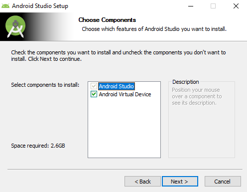

##### Set up a new Android Virtual Device:
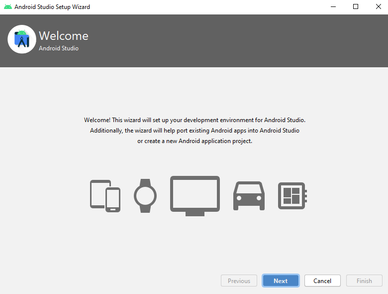

##### When the install is finished, click the configure button in the bottom right and select the "AVD Manager":


##### Click on "Create Virtual Device"


##### Select a piece of hardware to emulate (recommend to choose a device like the Pixel 4 or similar):


##### Choose a build of Android to be installed:


##### Verify the AVD's configuration:


##### You will now see the device added to your list of available devices, click on the green arrow icon if you want to launch the AVD now:


#### Installing Flutter:

##### Download Flutter from the official webpage:
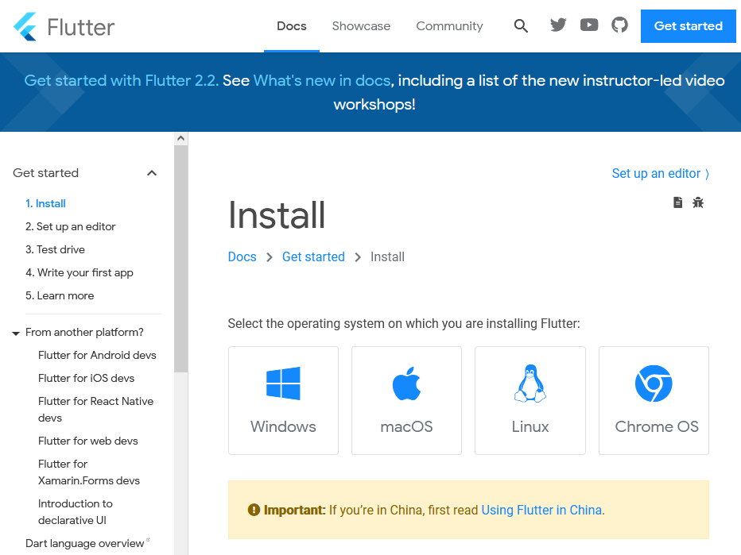

##### Click on the button with the link to the latest SDK:


##### Extract the flutter folder to a location on your machine (recommended: a folder in the root of your C: drive):
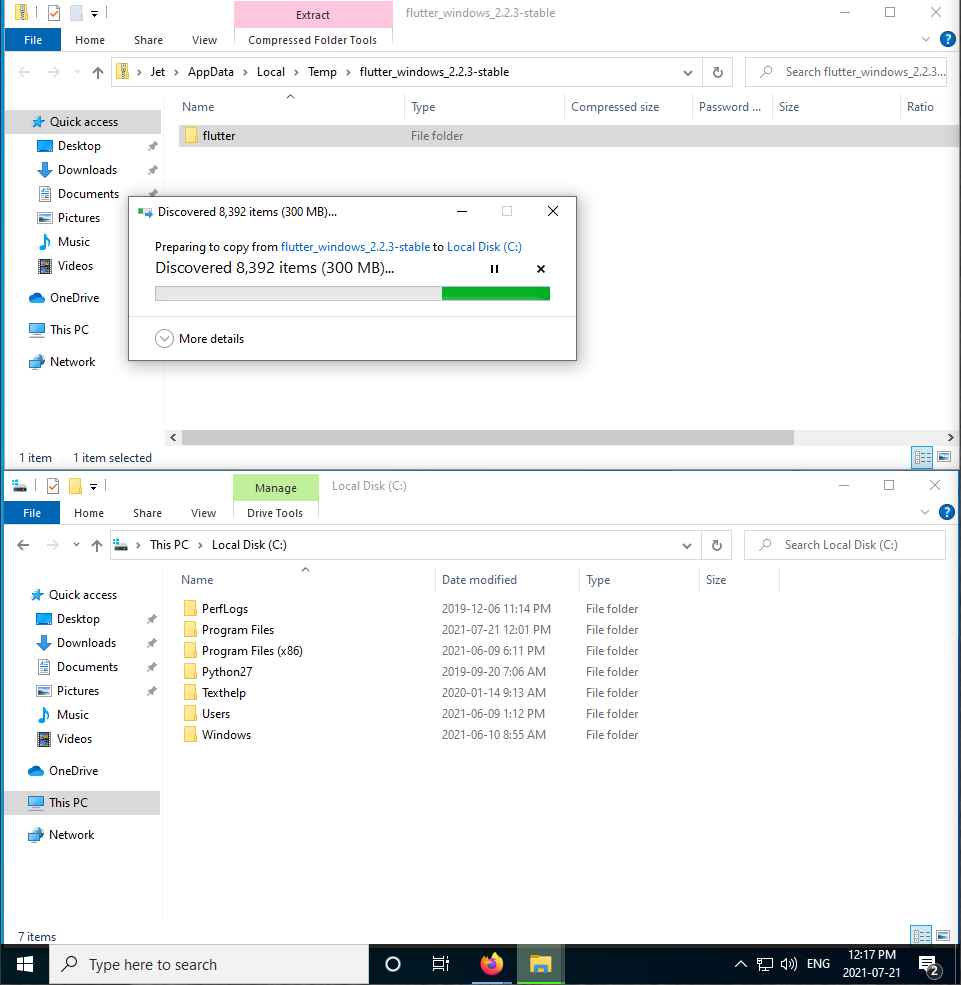

##### With the files copied, we now need to add Flutter to the system's PATH, first look up "environment" in the Start menu, and open "Edit the system environment variables" control panel:
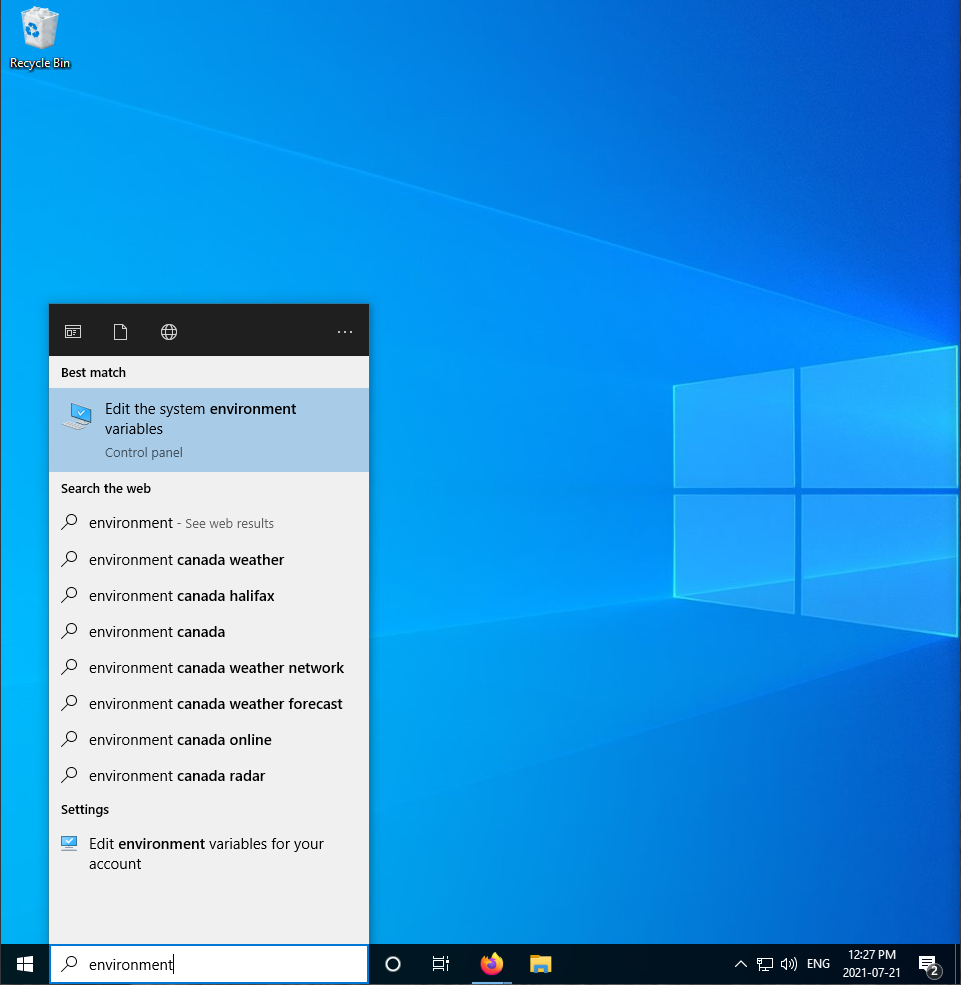

##### Click on "Environment Variables...":


##### Select "Path" in the top panel and click on "Edit":


##### Click on "New":
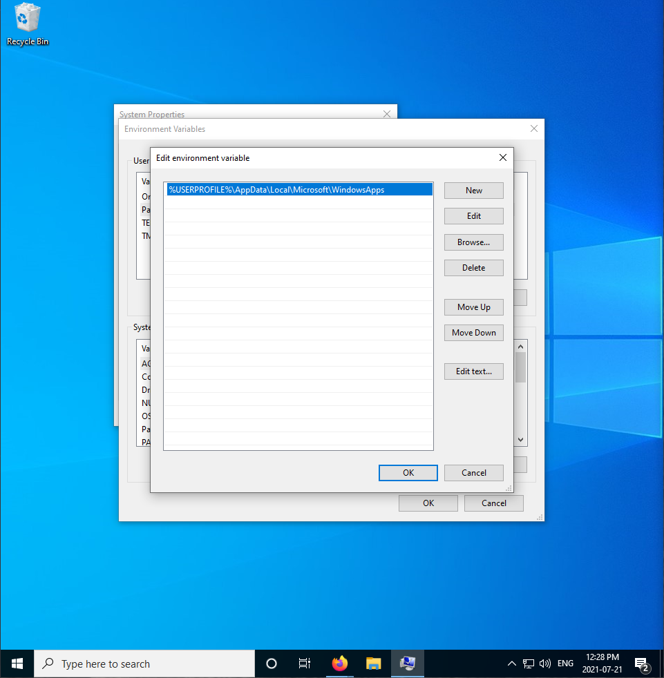

##### Add the path to the flutter\bin directory and click "OK" and restart your computer:
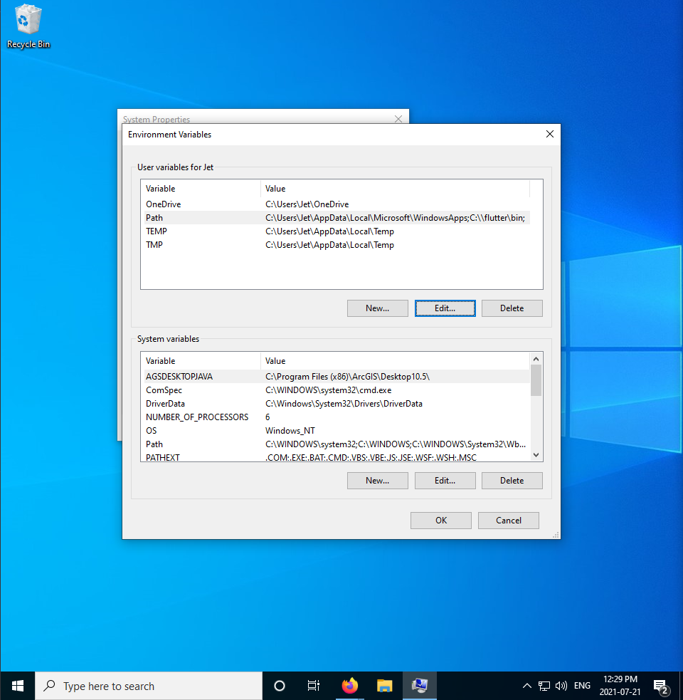

#### Installing VSCode:
##### Download VSCode from the Official Webpage:
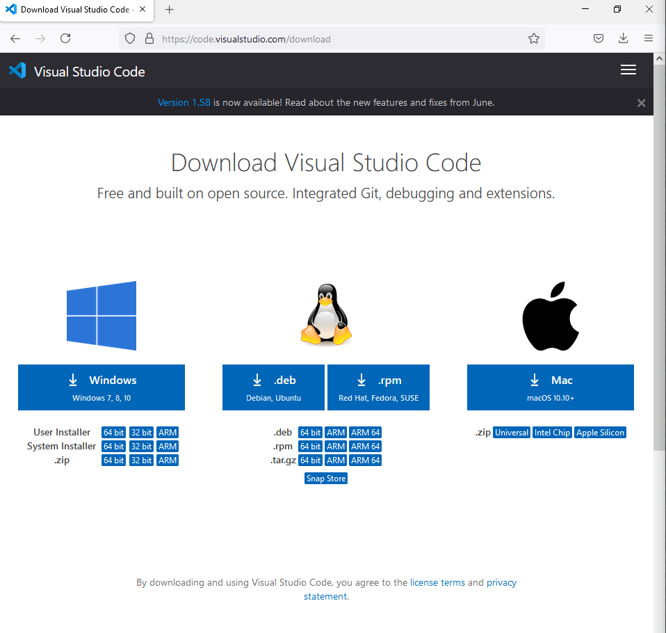

##### Open the installer and click through the dialog boxes, ensure that you check "Add to PATH":


##### VSCode Home Screen:
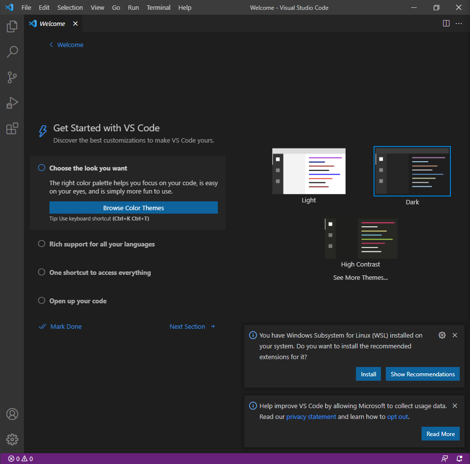

##### With the setup complete, navigate to the "Add-Ons" pane by clicking the icon in left sidebarl, search for and install the Flutter plugin:
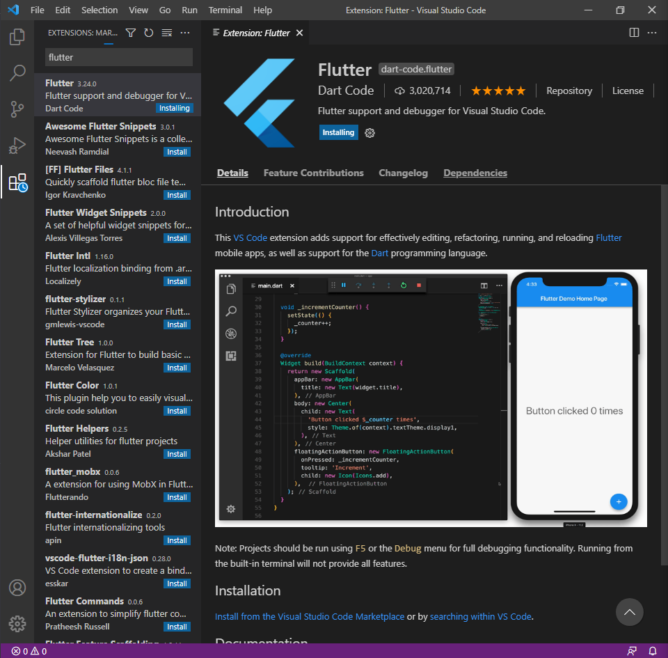
 
#### Opening and running the application:

##### Navigate to the project folder and right click on it, choose, "open with Code":


##### Open the main.dart file by navigating to it using the files sidebar on the left:


##### Click in the bottom right menu where it says "No Device", a list of the installed Android Virtual Devices, as well as the Flutter emulator option, will be displayed in the command pallet. Select the Android Virtual Device that you have created for this project, or one that already exists on your system:


##### The Android Virtual Device will be launched:


##### To compile and run the Flutter application, click on the "Run" button in the top right of the VSCode window and select "Start Debugging", the application will launch:


## User Features <a name="userFeatures"> </a>

## Technical Features <a name="technicalFeatures"> </a>

### Object Recognition:

#### Sourcing Lobster imagery:
<https://github.com/ultralytics/flickr_scraper>

We considered several sources for finding lobster imagery to train the machine learning model. Manual retrieval of images (i.e. manually saving images from a Google image search and social media websites) was undertaken to a limited degree, but is an undesirable methodology due to the tedious nature of saving each image through the computer's file manager dialogs. Instead it would be better to scrape; using a script, a large set of imagery that already had some kind of classification performed on it. There existsmany websites dedicated to sharing images, both for social media purposesand for data science research purposes. Two websites that were investigated in great detail were Flickr and Kaggle.

##### Flickr Scraper


In order to retrieve some of the lobster imagery, sources like Flickr were considered. In the particular case of Flickr, the Flickr API and publicly available tools like Flickr-Scraper by Ultralytics LLC, a Python program can be used to download the first Nth results of a Flickr search. The search term “Lobster” is too vague for use on this platform,resulting in numerous images of prepared lobster as foods like sandwiches and soups (rolls and bisques).

Here are the basics of using the utility with Python to find search results on Flickr for the term “Underwater Lobster”.

You can execute bash scripts in an R notebook using the instruction included here:
<https://bookdown.org/yihui/rmarkdown-cookbook/eng-bash.html>

Clone the flickr\_scraper-master repository:

    git clone https://github.com/ultralytics/flickr_scraper.git

List the contents of the working directory:

``` bash
ls
```

    ## README.md
    ## flickr_scraper-master
    ## lobster-detection.Rproj
    ## lobster-pictures.Rmd
    ## lobster-pictures.md
    ## lobster-pictures_files
    ## model

Change directories to the flickr\_scraper folder:

``` bash
cd flickr_scraper-master
ls
```

    ## LICENSE
    ## README.md
    ## flickr_scraper.py
    ## images
    ## requirements.txt
    ## utils

Since each bash chunk in an R Notebook exists seperately from the others, we will need to repeat the prior change directory command (cd) at the start when opening a new chunk, after installing flickr\_scraper, we can scrape images from the top search results on flickr with this command:

``` bash
cd flickr_scraper-master
python3 flickr_scraper.py --search 'underwater lobster' --n 10 --download
```

    ## 0/10 https://live.staticflickr.com/7327/27359314162_ebd5fa7e3c_o.jpg
    ## 1/10 https://live.staticflickr.com/4422/36900022252_4b7095c6ee_o.jpg
    ## 2/10 https://live.staticflickr.com/4370/36558985060_7a4c6b5bf3_o.jpg
    ## 3/10 https://farm9.staticflickr.com/8311/28506321636_43e0a87358_b.jpg
    ## 4/10 https://live.staticflickr.com/136/378049057_357ce9081f_o.jpg
    ## 5/10 https://farm5.staticflickr.com/4430/35752736414_8ae831132b_b.jpg
    ## 6/10 https://live.staticflickr.com/4422/36912415055_6f851ef094_o.jpg
    ## 7/10 https://live.staticflickr.com/5515/31110036502_3c66dc4453_o.jpg
    ## 8/10 https://live.staticflickr.com/7301/9225050520_332c40cff8_o.jpg
    ## 9/10 https://live.staticflickr.com/3292/2802678185_70b6c16c70_o.jpg
    ## Done. (30.0s)
    ## All images saved to /mnt/c/TensorFlow-model/flickr_scraper-master/images/underwater_lobster/

The utility will download the specified number of images and place them
in a subdirectory of the flickr-scraper folder.

There are other sources of imagery that could be considered as well, for instance, the review website Yelp provides a large open dataset of images that can be scraped for classified imagery. In the case of this project we will be scraping 1000 images. The contents of the scraped image folder are what would appear to a person if they were go to Flickr and do a search for "underwater lobster" in their main search bar, but we now have the files saved locally to our machine:


##### Kaggle (datasets - images):


Other sources of imagery, like Kaggle, were searched for good source imagery, but did not yield too many results beyond one collection of images of Spiny Lobsters by author Son Vo:

<https://www.kaggle.com/sonvoutas/large-lobster-image-dataset>


This Kaggle imagery set was used in training one version of the object recognition model, but is unyieldly to work with due to it's large size (24Gb) and efforts should be made to decrease the resolution of the sample imagery after downloading it if one wishes to be able to upload it to remote machine learning platforms in a timely manner, or to work locally with machines with lower-end hardware where training models for object recognition with high resolution imagery is impossible or impractical. Websites like Roboflow, which we will discuss later, have features that allow you to do that sort of processing, and more. Software like CVAT can also perform the task, or we can use command line (CLI) utilities like ImageMagick to perform this kind of processing:

<https://legacy.imagemagick.org/Usage/resize/>


### Training a TensorFlow tflite model with Google's Teachable Machine (Implemented Approach):

##### Click the "Get started" button in the upper right:


##### Click on the "Image Project" card to select a new image project:


##### Select "Standard image model":


##### You will be shown a blank screen representing the contents of the project, here you can see there are boxes for classes (the different types of objects we want to classify), a section for tweaking the training parameters, and a section for exporting the trained model:


##### We can begin by creating a new class label:


##### Click the upload button and select your imagery:


##### Once the images are uploaded, the you can click "Train Model" to begin the training process, or you can adjust the advanced parameters prior to the process beginning:


##### The training process may take some time, depending on the resolution and quantity of the source imagery and the advanced parameter settings:


##### When the model is trained, the export preview window will open:


##### We can also try adjusting some of the advanced parameters, like the number of epochs, the batch size and the learning rate:


##### We can view some statistical graphs, as well as calculate the accuracy per class and generate a confusion matrix. We can also see the accuracy per epoch and the test loss per epoch:


##### Click "export model" to export the model:


##### Once we have a model we are interested in exporting, we can do so by clicking the "Export Model" button and choose the "TensorFlow Lite" tab, make sure that the conversion type is set to Floating point, and click "convert model". This process may take some time. When completed the page will create file save alert dialog.


##### Choose a location to download the file to:


##### This will be the contents of the unzipped file, the tflite model and a text file with the classified labels:


## User Stories <a name="userStories"> </a>

| ID      | Description                                                                                                 |Status   |
| :---    |    :----:                                                                                                   |     ---:|
| 1       | As a User, I want to create add feedback for the app so that the app can have more accuracy                 |Approved |


## Issues <a name="issues"> </a>

## Risks <a name="risks"> </a>

## Lessons Learned <a name="lessonsLearned"> </a>

## Further Development Recommendation <a name="furtherDevelopmentRecommendation"> </a>

## Project Sign-off <a name="projectSignOff"> </a>

## References <a name="references"> </a>

### Dart documentation:
https://dart.dev/guides

https://dart.dev/get-dart


### Flutter documentation:
https://flutterflow.io/

https://flutter.dev/docs/get-started/install


### TensorFlow Lite (TFlite):
https://www.tensorflow.org/lite/guide

https://pub.dev/packages/tflite


### Material UI:
https://material.io/components


### YOLOv4:
https://github.com/pjreddie/darknet


### Video lessons and tutorials:
[YouTube - Installing Flutter on Mac - Nick Manning (seenickcode)](https://www.youtube.com/watch?v=THsihXK1-14)

[YouTube - Flutter Course - Full Tutorial for Beginners (Build iOS and Android Apps) - freeCodeCamp.org](https://www.youtube.com/watch?v=pTJJsmejUOQ)

[YouTube - Flutter: Build a Beautiful Pokemon App | Animation | Widgets | JSON API - mtechviral](https://www.youtube.com/watch?v=yeXJqZCiwTQ&t=480s)

[YouTube - Flutter iOS & Android Object Detection with TensorFlow Lite Deep Learning & Machine Learning Course - Coding Cafe](https://youtube.com/playlist?list=PLxefhmF0pcPmynNry6IksRAx0vNRns7Q1)

[YouTube - How to Train YOLOv4 on a Custom Dataset (PyTorch) - Roboflow](https://www.youtube.com/watch?v=9hVgyeI4g4o)


### Other documentation and resources:
[Curiousily- Object detection on a custom dataset](https://curiousily.com/posts/object-detection-on-custom-dataset-with-yolo-v5-using-pytorch-and-python/)


# Addendum

### Working with the images in R:

``` r
#install.packages("BiocManager") 
#BiocManager::install("EBImage")
library(EBImage)
```

``` r
list.files("model")
```

    ## [1] "README.roboflow.txt" "test"                "train"              
    ## [4] "valid"

Print a partial list of the files in the training folder:

``` r
head(list.files("model/train"))
```

    ## [1] "_annotations.csv"                                                    
    ## [2] "10005133744_d1060128ab_o_jpg.rf.d4d6ee263552c0ba135babf9436ce461.jpg"
    ## [3] "10068516014_6a4f5a5dc2_o_jpg.rf.ea96ee3048ea215cc59c124486e742f5.jpg"
    ## [4] "10116239786_b61e41db21_b_jpg.rf.cef0d87c0b126696b5d0160e1d6ecc8f.jpg"
    ## [5] "10508592885_c5d0dd4d2f_o_jpg.rf.c89cbecbea9359516cd6e0b29bbfd8c9.jpg"
    ## [6] "10631742534_05d86a3212_b_jpg.rf.57a444d1755d1842ae96d4c5f583c6cf.jpg"

Load a single image sample:

``` r
sampleLobster <- readImage("model/train/10631742534_05d86a3212_b_jpg.rf.57a444d1755d1842ae96d4c5f583c6cf.jpg")
```

Display the sample image:

``` r
display(sampleLobster, method = "raster")
```

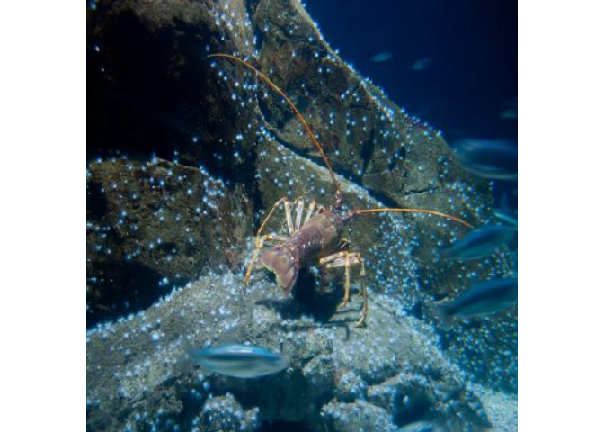<!-- -->

Create a vector that will store the file paths:

``` r
trainingImagesPath <- dir("model/train")
```

Remove the .csv file from the list:

``` r
trainingImagesPath <- paste("model/train/", trainingImagesPath[2:length(trainingImagesPath)], sep ="")
```

Read the images to a vector with a loop:

``` r
trainingImages <- readImage(trainingImagesPath)
```

Display all the images in the training set on a single raster:

``` r
display(trainingImages, method = "raster", all = TRUE, nx = 10)
```

<!-- -->

The first half of this document is based on the guide from [TensorFlow for R from R
Studio](https://tensorflow.rstudio.com/tutorials/beginners/basic-ml/tutorial_basic_classification/) and shows the basic setup of a “hello world” object recognition application using R:

> This guide uses the Fashion MNIST dataset which contains 70,000
> grayscale images in 10 categories. The images show individual articles
> of clothing at low resolution (28 by 28 pixels)
> <https://github.com/rstudio/tensorflow>

### Installation and setup:

Install/Load the required packages:

``` r
#Uncomment the following line to include the installation of the keras package:
#install.packages("keras")
#install.packages("tensorflow")
```

Load the keras library in to the R session:

``` r
library(keras)
library(tensorflow)
```

If required, install Tensorflow with this

``` r
#install_tensorflow()
```

You will need to have also installed anacoda for TensorFlow to work in R, as well as CUDA. These instructions from a github user
[CostanzoPablo](https://github.com/CostanzoPablo) were helpful in getting cuda tensorflow/stream\_executor/platform/default/dso\_loader/cudart64\_110.dll to work on my machine:

> -   Uninstall all drivers that says “nvidia” from Uninstall programs
>     (ALL, Cuda and gpu driver)
> -   Install last nvidia drivers for your GPU
>     <https://uk.download.nvidia.com/GFE/GFEClient/3.21.0.36/GeForce_Experience_v3.21.0.36.exe>
> -   Install cuda 11.2
>     <https://developer.download.nvidia.com/compute/cuda/11.2.1/local_installers/cuda_11.2.1_461.09_win10.exe>
> -   Install Anaconda
>     <https://repo.anaconda.com/archive/Anaconda3-2020.11-Windows-x86_64.exe>
> -   conda create -n cudaenv python=3.6
> -   conda activate cudaenv
> -   pip install tensorflow python-dotenv
> -   Create a.py with this: import tensorflow as tf
> -   run it: python a.py
> -   Output: xxx: I
>     tensorflow/stream\_executor/platform/default/dso\_loader.cc:49\]
>     Successfully opened dynamic library cudart64\_110.dll
> <https://github.com/tensorflow/tensorflow/issues/45055>

### Basic Example: Importing the Fashion MNIST dataset

> Fashion MNIST is intended as a drop-in replacement for the classic
> MNIST dataset—often used as the “Hello, World” of machine learning
> programs for computer vision. The MNIST dataset contains images of
> handwritten digits (0, 1, 2, etc) in an identical format to the
> articles of clothing we’ll use here. This guide uses Fashion MNIST for
> variety, and because it’s a slightly more challenging problem than
> regular MNIST. Both datasets are relatively small and are used to
> verify that an algorithm works as expected. They’re good starting
> points to test and debug code. We will use 60,000 images to train the
> network and 10,000 images to evaluate how accurately the network
> learned to classify images. You can access the Fashion MNIST directly
> from Keras.
> [TensorFlow for R from R Studio](https://tensorflow.rstudio.com/tutorials/beginners/basic-ml/tutorial_basic_classification/)

``` r
fashion_mnist <- dataset_fashion_mnist()
```

Specify the training and testing data:

``` r
c(train_images, train_labels) %<-% fashion_mnist$train
c(test_images, test_labels) %<-% fashion_mnist$test
```

Specifiying the class names:

``` r
class_names = c('T-shirt/top',
                'Trouser',
                'Pullover',
                'Dress',
                'Coat', 
                'Sandal',
                'Shirt',
                'Sneaker',
                'Bag',
                'Ankle boot')
```

Improting tidyr and ggplot:

``` r
library(tidyr)
library(ggplot2)
```

### Plotting an image from the MNSIT Dataset

``` r
image_1 <- as.data.frame(train_images[1, , ])
colnames(image_1) <- seq_len(ncol(image_1))
image_1$y <- seq_len(nrow(image_1))
image_1 <- gather(image_1, "x", "value", -y)
image_1$x <- as.integer(image_1$x)

ggplot(image_1, aes(x = x, y = y, fill = value)) +
  geom_tile() +
  scale_fill_gradient(low = "white", high = "black", na.value = NA) +
  scale_y_reverse() +
  theme_minimal() +
  theme(panel.grid = element_blank())   +
  theme(aspect.ratio = 1) +
  xlab("") +
  ylab("")
```

<!-- -->

``` r
train_images <- train_images / 255
test_images <- test_images / 255
```

Plotting sample of the imported imagery on a “proofing sheet”:

``` r
par(mfcol=c(5,5))
par(mar=c(0, 0, 1.5, 0), xaxs='i', yaxs='i')
for (i in 1:25) { 
  img <- train_images[i, , ]
  img <- t(apply(img, 2, rev)) 
  image(1:28, 1:28, img, col = gray((0:255)/255), xaxt = 'n', yaxt = 'n',
        main = paste(class_names[train_labels[i] + 1]))
}
```

<!-- -->

### Build the model

``` r
model <- keras_model_sequential()
model %>%
  layer_flatten(input_shape = c(28, 28)) %>%
  layer_dense(units = 128, activation = 'relu') %>%
  layer_dense(units = 10, activation = 'softmax')
```

### Compile the model:

``` r
model %>% compile(
  optimizer = 'adam', 
  loss = 'sparse_categorical_crossentropy',
  metrics = c('accuracy')
)
```

### Train the model:

``` r
model %>% fit(train_images, train_labels, epochs = 5, verbose = 2)
```

Test the quality of the model:

``` r
score <- model %>% evaluate(test_images, test_labels, verbose = 0)

cat('Test loss:', score[c("loss")], "\n")
```

    ## Test loss: 0.3512006

``` r
cat('Test accuracy:', score[c("acc")], "\n")
```

    ## Test accuracy: NA

Make a prediction for each of the items based on the trained model:

``` r
predictions <- model %>% predict(test_images)
```

``` r
predictions[1, ]
```

    ##  [1] 1.718195e-04 2.529461e-06 1.136201e-05 1.307185e-06 2.752328e-05
    ##  [6] 3.222493e-02 6.994441e-05 1.519411e-01 1.144956e-03 8.144045e-01

Show the same proofing sheet as before but with a label for whether the
prediction was correct or incorrect (red or green):

``` r
par(mfcol=c(5,5))
par(mar=c(0, 0, 1.5, 0), xaxs='i', yaxs='i')
for (i in 1:25) { 
  img <- test_images[i, , ]
  img <- t(apply(img, 2, rev)) 
  # subtract 1 as labels go from 0 to 9
  predicted_label <- which.max(predictions[i, ]) - 1
  true_label <- test_labels[i]
  if (predicted_label == true_label) {
    color <- '#008800' 
  } else {
    color <- '#bb0000'
  }
  image(1:28, 1:28, img, col = gray((0:255)/255), xaxt = 'n', yaxt = 'n',
        main = paste0(class_names[predicted_label + 1], " (",
                      class_names[true_label + 1], ")"),
        col.main = color)
}
```

<!-- -->

Make a prediction on a singular image:

``` r
# Grab an image from the test dataset
# take care to keep the batch dimension, as this is expected by the model
img <- test_images[1, , , drop = FALSE]
dim(img)
```

    ## [1]  1 28 28

``` r
predictions <- model %>% predict(img)
predictions
```

    ##              [,1]         [,2]         [,3]         [,4]         [,5]
    ## [1,] 0.0001718195 2.529461e-06 1.136202e-05 1.307184e-06 2.752328e-05
    ##            [,6]         [,7]      [,8]        [,9]     [,10]
    ## [1,] 0.03222495 6.994441e-05 0.1519411 0.001144954 0.8144045

``` r
# subtract 1 as labels are 0-based
prediction <- predictions[1, ] - 1
which.max(prediction)
```

    ## [1] 10

``` r
class_pred <- model %>% predict_classes(img)
class_pred
```

    ## [1] 9

### Training a TensorFlow model with Keras and R (Alternative approach, incomplete):

#### Annotating the images with Roboflow:

Login to Roboflow and select "Create a Project":


Choose "Object Detection (Bounding Box) for the project type:


Add the annotation groups (list of objects to be identified):


Use the Upload pane to upload the scraped image files:


Using the Trash Can Icon, you can remove images from the uploaded set:


We can now specify what ratio we would like to use to split the training/testing/validation sets:


We can see in the panel indicator that the images have been split in to seperate sets:


Clicking on any of the images will open the annotation tools, draw a bounding box around a lobster, and click save to add the annotation to the dataset:


Once images are annotated, their bounding area boxes are shown in preview:


Click on "Dataset" on the left side bar to open the version generation tools:


Verify the specifications regarding testing/training/validation split:


Perform optional pre-processing steps:


(Example) Resize pre-processing:


Perform optional augmentation steps:

